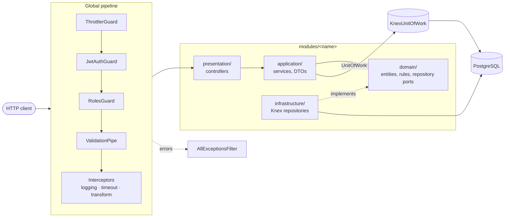
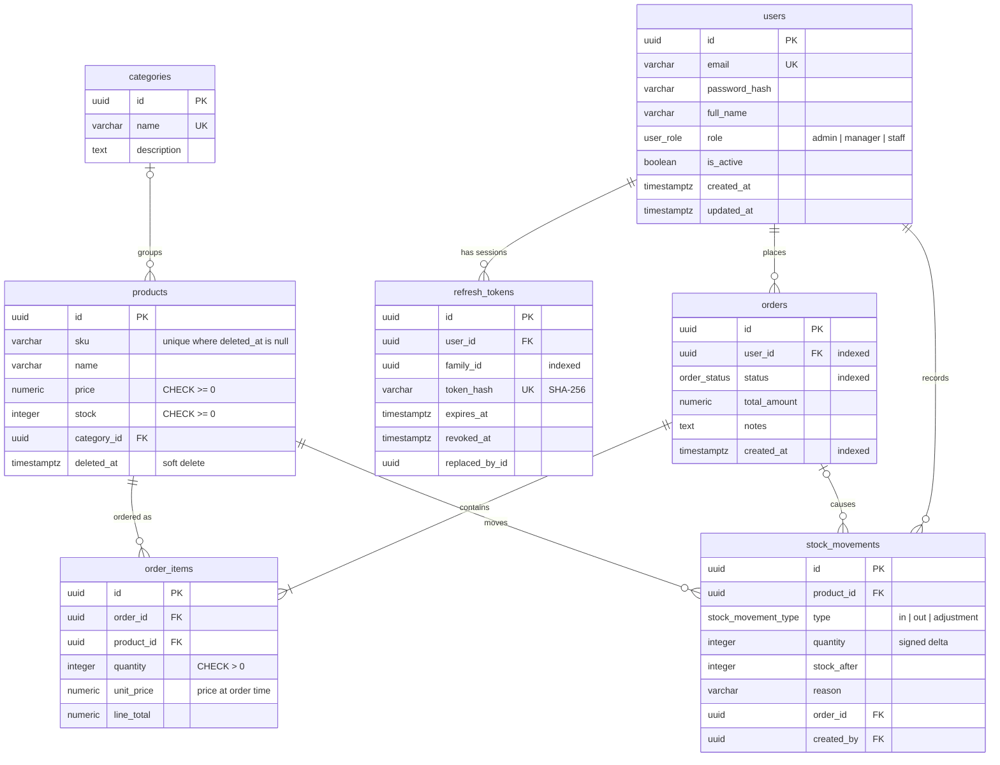

# nest-erp-api

[](https://github.com/AymanYassien/nest-erp-api/actions/workflows/ci.yml)


A mini ERP REST API for users, inventory and orders, built with **NestJS 12**, **PostgreSQL** and **Knex** (no ORM). It is a portfolio project, so it focuses on the parts of backend work that are hard to get right: refresh-token rotation with reuse detection, role-based access control, and order placement that reserves stock inside a database transaction. It never oversells, even under concurrent requests. Each module follows Clean Architecture, every endpoint is documented in Swagger, and the test suite includes end-to-end tests against a real PostgreSQL database.

## Features

- **Auth**: register, login, refresh and logout. Access tokens last 15 minutes and refresh tokens 7 days. Refresh tokens are stored hashed and rotated on every use, and reusing an old one revokes the whole token family.
- **RBAC**: `admin`, `manager` and `staff` roles. A `@Roles()` decorator works with global `JwtAuthGuard` and `RolesGuard`, and `@Public()` marks open routes.
- **Inventory**: categories, and products with a SKU, price and stock. Products are soft-deleted and can be restored. Each stock movement (`in`, `out` or `adjustment`) is written in the same transaction as the stock update.
- **Orders**: placing an order checks and decrements stock for every line in a single Knex transaction. Status workflow: `pending → confirmed → shipped → delivered`, with cancellation allowed before shipping, which returns the stock. Invalid transitions get a 409.
- **Cross-cutting concerns**:
  - Response envelope: `{ success, data, meta }`.
  - Global exception filter. Postgres unique violations become 409 and foreign-key violations become 400.
  - Logging and timeout interceptors.
  - Rate limiting, with a stricter limit on credential endpoints.
  - Pagination, sorting and filtering helpers for every list endpoint.
  - Strict validation (`whitelist` + `forbidNonWhitelisted`).
  - Environment validated at startup.
  - `/health` endpoint.
- **Docs**: OpenAPI at `/docs` with bearer auth, plus example payloads and documented error responses on every endpoint.
- **Quality**: TypeScript strict mode and type-aware ESLint. 167 unit tests (about 94% coverage of `application/`, `domain/` and `common/`) and 42 e2e tests. A GitHub Actions workflow runs everything against a PostgreSQL service container.

## Architecture

Each feature module has four layers, and dependencies point inward. Services depend on **repository ports** (abstract classes in `domain/`). Only `infrastructure/` imports Knex.



```
src/
  common/          guards, interceptors, filters, decorators, pagination, validation, domain errors
  config/          Joi-validated environment and a typed config service
  database/        Knex module, unit of work, pagination helper, migrations, seeds
  health/          GET /health
  modules/
    auth/          register, login, refresh (rotation + reuse detection), logout
    users/         CRUD, roles, password hashing port
    inventory/     categories, products, stock movements
    orders/        orders, order items, status workflow
  modules/<name>/
    domain/          entities, business rules, repository ports
    application/     services (use cases) and DTOs
    infrastructure/  Knex repository implementations
    presentation/    controllers
```

## Data model



## Getting started

### Prerequisites

- **Node.js 24.9+**. NestJS 12 ships as ESM-only, and Jest can only `require()` ESM packages from Node 24.9 on. Run `nvm use` to pick up the version in `.nvmrc`.
- **PostgreSQL 13+**, for the built-in `gen_random_uuid()`.

### 1. Install

```bash
git clone https://github.com/AymanYassien/nest-erp-api.git
cd nest-erp-api
nvm use
npm install
```

### 2. Create the databases

With a local PostgreSQL installation (for example `brew install postgresql@17 && brew services start postgresql@17` on macOS, or your distro's `postgresql` package on Linux):

```bash
createdb nest_erp        # development
createdb nest_erp_test   # e2e tests (wiped on every run)
```

If you need a dedicated role:

```sql
CREATE ROLE erp WITH LOGIN PASSWORD 'erp';
ALTER DATABASE nest_erp OWNER TO erp;
ALTER DATABASE nest_erp_test OWNER TO erp;
```

### 3. Configure

```bash
cp .env.example .env
```

Set `DB_USER`, `DB_PASSWORD` and a random `JWT_ACCESS_SECRET` (at least 32 characters):

```bash
node -e "console.log(require('crypto').randomBytes(48).toString('hex'))"
```

The app validates the environment on startup and refuses to boot if anything is missing or malformed.

### 4. Migrate and seed

```bash
npm run db:migrate
npm run db:seed
```

The seed creates three users that share the password `Password123!`:

| Email               | Role    |
| ------------------- | ------- |
| `admin@erp.local`   | admin   |
| `manager@erp.local` | manager |
| `staff@erp.local`   | staff   |

It also adds 3 categories and 7 products, each with an opening-balance stock movement.

### 5. Run

```bash
npm run start:dev     # watch mode
# or
npm run build && npm run start:prod
```

- API: <http://localhost:3000/api/v1>
- Swagger UI: <http://localhost:3000/docs>. Log in via `POST /auth/login`, click **Authorize** and paste the `accessToken`.
- Health: <http://localhost:3000/health>

```bash
curl -s -X POST localhost:3000/api/v1/auth/login \
  -H 'content-type: application/json' \
  -d '{"email":"admin@erp.local","password":"Password123!"}'
```

## API overview

All routes except `/health` are prefixed with `/api/v1`. "Any" means any authenticated user.

| Method   | Path                              | Roles             | Notes                                                   |
| -------- | --------------------------------- | ----------------- | ------------------------------------------------------- |
| `GET`    | `/health`                         | Public            | DB connectivity check                                   |
| `POST`   | `/auth/register`                  | Public            | Always creates a `staff` user                           |
| `POST`   | `/auth/login`                     | Public            | Returns user + token pair                               |
| `POST`   | `/auth/refresh`                   | Public            | Rotates the refresh token                               |
| `POST`   | `/auth/logout`                    | Any               | Revokes the session (token family)                      |
| `GET`    | `/users/me`                       | Any               | Current profile                                         |
| `GET`    | `/users`                          | admin, manager    | Filter: `role`, `isActive`, `search`                    |
| `GET`    | `/users/:id`                      | admin, manager    |                                                         |
| `POST`   | `/users`                          | admin             | Create a user with any role                             |
| `PATCH`  | `/users/:id`                      | admin             | Can't change own role or deactivate self                |
| `DELETE` | `/users/:id`                      | admin             | 400 if the user owns orders (FK)                        |
| `GET`    | `/categories`                     | Any               | Filter: `search`                                        |
| `GET`    | `/categories/:id`                 | Any               |                                                         |
| `POST`   | `/categories`                     | admin, manager    | 409 on duplicate name                                   |
| `PATCH`  | `/categories/:id`                 | admin, manager    |                                                         |
| `DELETE` | `/categories/:id`                 | admin             | Products become uncategorised                           |
| `GET`    | `/products`                       | Any               | Filter: `search`, `categoryId`, `minPrice`, `maxPrice`, `inStock` |
| `GET`    | `/products/:id`                   | Any               |                                                         |
| `POST`   | `/products`                       | admin, manager    | Optional `initialStock` (booked as a movement)          |
| `PATCH`  | `/products/:id`                   | admin, manager    | Stock is not editable here                              |
| `DELETE` | `/products/:id`                   | admin             | Soft delete                                             |
| `POST`   | `/products/:id/restore`           | admin             | Undo soft delete                                        |
| `POST`   | `/products/:id/stock-movements`   | admin, manager    | `in` / `out` / `adjustment`, transactional              |
| `GET`    | `/products/:id/stock-movements`   | admin, manager    | Filter: `type`                                          |
| `POST`   | `/orders`                         | Any               | Transactional stock reservation                         |
| `GET`    | `/orders`                         | Any               | Staff see only their own; filter `status`, `userId`, `createdFrom`, `createdTo` |
| `GET`    | `/orders/:id`                     | Any               | Staff get 404 for other users' orders                   |
| `PATCH`  | `/orders/:id/status`              | admin, manager    | Workflow enforced; cancel restocks                      |

**List endpoints** all accept `page` (default 1), `limit` (default 20, max 100), `sortBy` (a per-resource whitelist) and `sortOrder` (`asc` or `desc`).

**Response shapes**

```jsonc
// success
{ "success": true, "data": { ... } }
// paginated success
{ "success": true, "data": [ ... ], "meta": { "page": 1, "limit": 20, "total": 42, "totalPages": 3 } }
// error
{
  "success": false,
  "error": { "statusCode": 409, "code": "INSUFFICIENT_STOCK", "message": "Insufficient stock for product 'FUR-DESK-STAND' (requested 9)" },
  "meta": { "method": "POST", "path": "/api/v1/orders", "timestamp": "2026-01-15T09:30:00.000Z" }
}
```

| Error source                                                    | Status | `code`                                              |
| --------------------------------------------------------------- | ------ | --------------------------------------------------- |
| Validation failure (details listed per field)                   | 400    | `VALIDATION_ERROR`                                  |
| Postgres foreign-key / check violation                          | 400    | `FOREIGN_KEY_VIOLATION` / `CHECK_VIOLATION`         |
| Missing or invalid token                                        | 401    | `UNAUTHORIZED`                                      |
| Role not allowed                                                | 403    | `FORBIDDEN`                                         |
| Unknown resource                                                | 404    | `NOT_FOUND`                                         |
| Postgres unique violation                                       | 409    | `UNIQUE_VIOLATION`                                  |
| Insufficient stock / invalid order transition                   | 409    | `INSUFFICIENT_STOCK` / `INVALID_STATUS_TRANSITION`  |
| Business rule (e.g. duplicate order lines, self-demotion)       | 422    | `BUSINESS_RULE_VIOLATION`                           |
| Rate limit                                                      | 429    | `TOO_MANY_REQUESTS`                                 |
| Unexpected error (details are logged, never returned)           | 500    | `INTERNAL_ERROR`                                    |

## Testing

```bash
npm run test        # unit tests
npm run test:cov    # unit tests + coverage (fails below 80%)
npm run test:e2e    # e2e tests against DB_TEST_NAME (default nest_erp_test)
npm run lint        # type-aware ESLint + Prettier
npm run typecheck   # tsc --noEmit over src and test
```

- **Unit tests** mock the repository ports and the `UnitOfWork`, so services, guards, interceptors, the exception filter, DTO validation and the domain rules (order status workflow, money maths, stock deltas) run without a database.
- **E2E tests** boot the real `AppModule` against a separate PostgreSQL database. The schema is rebuilt once per run, and tables are truncated between tests. They cover:
  - Refresh rotation, reuse detection and logout.
  - RBAC denials (403).
  - Unique and foreign-key error mapping.
  - Soft delete.
  - Order creation.
  - Rollback when one line has insufficient stock: the order row, the item rows and an already-applied decrement are all undone.
  - Concurrent orders that never oversell.
  - The status workflow.
- As a safety net, the e2e setup refuses to run unless the target database name ends in `_test`.

## Design decisions

### Why Knex instead of an ORM?

This domain is mostly about **getting the SQL right under concurrency**. Two examples:

- A conditional `UPDATE products SET stock = stock + ? WHERE id = ? AND stock >= ?` is the whole stock-reservation algorithm.
- A partial unique index lets a soft-deleted SKU be reused.

With Knex the queries stay visible and reviewable, and migrations are explicit. Nothing is generated behind the scenes: there is no lazy loading and no implicit N+1. For example, order items for a page of orders are fetched with one `WHERE order_id IN (...)` query. The trade-off is hand-written row mappers, which live in each repository.

### Why Clean Architecture?

- Services depend on ports (`UsersRepository`, `ProductsRepository`, `PasswordHasher`, `UnitOfWork`), not on Knex or bcrypt. Business rules can therefore be unit-tested with plain mocks and no database. The persistence layer could be swapped without touching use cases.
- Ports are **abstract classes**, not TypeScript interfaces, because abstract classes exist at runtime and can be used directly as Nest DI tokens without string or Symbol tokens.
- Domain errors (`NotFoundError`, `InsufficientStockError`, …) are framework-agnostic. Only the global filter knows how they map to HTTP.

### Transactions without leaking Knex

Order placement touches several repositories, which have to commit or roll back together. The application layer asks the `UnitOfWork` port to `run(async (tx) => …)` and passes the opaque `TransactionContext` to each repository call. The Knex implementation wraps `knex.transaction()`, so a thrown error rolls everything back.

Placing an order works like this:

1. Load the products and price the lines in integer cents, so there is no floating-point drift.
2. Insert the order and its items.
3. Decrement stock line by line, sorted by product id. Each decrement is a single conditional `UPDATE`. Its row lock serialises concurrent writers, and the `stock >= qty` predicate makes overselling impossible. Sorting by id gives every transaction the same lock order, which prevents deadlocks.
4. If any line fails, the transaction rolls back the order and every earlier decrement. A `CHECK (stock >= 0)` constraint backs this up at the database level.

### How refresh-token rotation works

```mermaid
sequenceDiagram
    participant C as Client
    participant A as API
    participant DB as refresh_tokens

    C->>A: POST /auth/login
    A->>DB: insert T1 (family F, hash(T1))
    A-->>C: access token + T1

    C->>A: POST /auth/refresh {T1}
    A->>DB: revoke T1 IF still active (atomic)
    A->>DB: insert T2 (family F)
    A-->>C: access token + T2

    Note over C,A: T1 was stolen and is replayed
    C->>A: POST /auth/refresh {T1}
    A->>DB: T1 already revoked → revoke all of family F
    A-->>C: 401 Refresh token reuse detected
    Note over C,DB: T2 is now dead too; the user must log in again
```

- **Opaque tokens, hashed at rest**: refresh tokens are 384-bit random strings, not JWTs, because they are only ever checked against the database. Only their SHA-256 hash is stored, so a database leak does not expose usable tokens. SHA-256 is safe here, unlike for passwords, because the input has high entropy, and a deterministic hash allows indexed lookup.
- **Family-based reuse detection**: every token from one login shares a `family_id`. Presenting a revoked token means it was copied, so the whole family is revoked. Other sessions (other devices) are unaffected.
- **Race-safe rotation**: the old token is revoked with `UPDATE … WHERE id = ? AND revoked_at IS NULL`. If two requests race with the same token, exactly one wins, and the other is treated as reuse.
- **Short-lived access tokens**: JWTs last 15 minutes and are verified statelessly. Deactivating a user blocks their next refresh.
- **Login timing**: login compares against a dummy bcrypt hash when the email is unknown, so response time does not reveal which emails exist.

### Other choices

- **Money**: `NUMERIC(12,2)` in the database, with totals computed in integer cents in the domain.
- **Soft delete**: products only. `sku` is unique among live rows via a partial index, and order history keeps pointing at deleted products.
- **Stock history**: stock is never edited directly. Every change, whether opening stock, an order, a cancellation or a manual adjustment, is a `stock_movements` row with the resulting `stock_after`.
- **Migrations in production**: Knex records migrations without their file extension, so a database migrated from TypeScript in development can later be migrated from the compiled build (`npm run build && npm run db:migrate:prod`) without ts-node.
- **Enumeration resistance**: staff get a 404 rather than a 403 for other users' orders, so they can't probe which order ids exist.

## License

[MIT](LICENSE)
